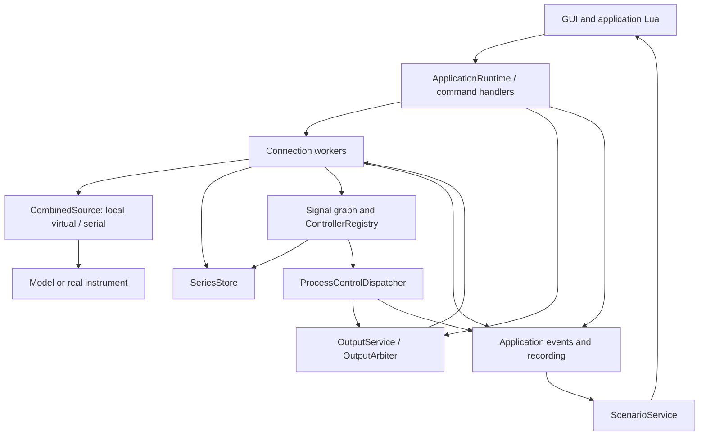

# Architecture

`ApplicationRuntime` is the composition root. It builds connection workers, Lua execution, processing, output arbitration and the emulator, and holds handles to the application-session recorder/log. `MyApp` owns it and GUI models. Domain logic is separated from egui rendering.

## Data and command flow

The output feedback path is a message pipeline, not recursive hardware access: processing emits intents, output arbitration grants permission, and a worker carries out the transaction.

## Ownership and threads

| Owner | State / responsibility | Communication |
| --- | --- | --- |
| GUI / `MyApp` | GUI models, selected profile, `ApplicationRuntime` | Polls events and submits commands. |
| Lua worker | One persistent application Lua state and script registry | Bounded input commands, application commands/events, reply channels. |
| Each connection worker | Acquisition source, serial connection, poll schedule/health | Sequential commands and samples; shared series metadata snapshots. |
| Processing service | Filter graph, controller registry, diagnostics | Processing commands, processed samples and control events. |
| Process-control dispatcher | Automatic write forwarding and output recording | Waits for output-write responses outside the processing thread. |
| Output service | Ownership modes, pending writes, completion generations | Serializes arbitration requests and hardware completions. |
| Emulator thread | Model Lua state, protocol decoder/server | Memory endpoint or optional serial transport. |
| Recorder writer | SQLite connection and sink failure state | Unbounded queued records. |

`SeriesStore` is shared behind synchronization; do not hold its lock across an I/O operation or a synchronous service request that could need the store. Domain objects such as `SeriesId` remain stable across display-name changes.

Several channels are bounded; synchronous handles can wait. Keeping physical I/O on workers does not mean every GUI action is nonblocking: controller pause/removal/reload can wait for safe-write completion. There is no hard real-time scheduling guarantee.

## Acquisition routing and scheduling

`AcquisitionSource` methods return `Ok(None)` for an unsupported operation. `CombinedSource` tries sources in order and stops at the first supported result or error. Unsupported means “ask the next source”; an error means “this backend owns the operation but it failed.”

The memory source precedes serial on primary. It owns virtual requests even when its session is stopped. Serial handles Metakon and raw text, and virtual protocol requests when no local source claims them. Creating another serial instrument normally extends the existing serial backend rather than adding a source.

Workers synchronize per-series schedules from metadata. An explicit series interval wins over the default. Due polls run before interactive transactions; schedules advance from completion time so slow I/O does not generate an unbounded catch-up burst. Three consecutive failed polling cycles suspend only the affected series. Successful manual I/O on the same parameter and explicit retry can restore it.

Raw measurements are appended and recorded at the worker, then sent to processing. Processed/diagnostic measurements return to the runtime for storage and recording. The graph validates duplicate outputs/cycles; removal computes affected descendants.

## Controllers and output

A `ControlLoopDefinition` binds a name, input ID, algorithm and output target. Each definition gets a fresh instance ID. `ControllerRegistry` validates the output range at installation and reconfiguration. Algorithm modules own their own parameter keys and candidate validation. `Controller` supplies dispatch; `ControlLoop` adds references and computation lifecycle.

Creation first registers ownership and then installs processing. If installation fails, ownership registration is rolled back. Removal safely pauses before releasing ownership. Input-series deletion and clear use the same safety coordination for affected loops.

The output service tracks connected parameter addresses, not just names. Manual writes, pending automatic takeover, tracked completions and stale generations are explained in [output safety](output-safety.md). Controller diagnostics are computation data; actual writes are separate results.

## Lua and scenarios

Bindings convert Lua values into typed `UserCommand` variants; they do not own serial ports. Fire-and-forget commands enqueue actions. Reads, writes and controller requests carry response senders. A timed-out Lua wait does not recall a request already sent to a worker.

Script registration retains Lua tables and named callbacks. UI declarations become GUI models through application events. Scenarios evaluate timers/measurements in Rust and call short Lua callbacks. They wait for tracked action completion before advancing; recorder failure does not suppress these application events. Run IDs prevent old actions from advancing replacement scenarios.

## Startup, reload and shutdown

Initial startup discovers paths, loads a validated profile or defaults, establishes logging/recording, then builds the runtime. Lua installs the API, runs setup and application scripts. Runtime initialization pumps application commands so synchronous Lua discovery can finish; simply joining Lua during startup would deadlock its replies.

Reload validates the profile before touching the current experiment. It safely pauses all controllers while transports remain alive, then stops old acquisition/emulator and builds the replacement. It drains completion events while stopping without executing queued new Lua actions. Candidate setup may have side effects; failure after stopping leaves the old runtime available but does not resume it automatically.

Normal runtime destruction attempts safe outputs first, then stops acquisition/emulator. Field destruction subsequently joins Lua, connection, processing and output-related threads. The session recorder is shared; its final owner drains/joins the writer. A successfully retired old runtime skips additional safe writes after a replacement starts. Failures are logged and shutdown proceeds; arbitrary native blocking code remains a limitation.

## Extension boundaries

Use [development](development.md) for concrete instrument/controller workflows. Preserve these boundaries:

- Wire encoding, framing and CRC belong in `protocol`.
- Device parameter semantics and conversion belong in `instrument`.
- Per-connection scheduling and transactions belong in acquisition/workers.
- Algorithms and their own parameter knowledge belong in `process_control`.
- Output authorization belongs in `output_control`.
- Lua bindings validate/translate; GUI views render.
- Recording publishes observability without becoming a control dependency.
