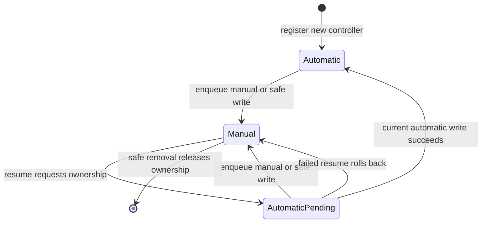

# Output ownership and safety

The output service serializes ownership decisions for each `ConnectedParameterAddress`: connection plus physical parameter address. Controller name alone is insufficient; a unique instance ID prevents stale events from a removed/recreated controller from reaching the output.

These mechanisms govern software writes. They do not prove that equipment is safe after a failed transport transaction, application crash or power failure.

## Modes and transitions

| Mode | Meaning |
| --- | --- |
| `Manual` | Automatic writes from the registered controller are rejected. |
| `AutomaticPending` | Automatic writes are allowed, but none from this takeover generation has yet been acknowledged successfully. |
| `Automatic` | Automatic writes are allowed. New controller registration starts here directly. |



Registration does not first write the safe value. Resume does not send a safe value either: the first successful **automatic** write completes its pending transition. A failed automatic hardware write records the error and leaves pending ownership pending; a later successful write can complete it.

Each takeover has a generation number. Only a completion for the current controller instance, current generation and pending mode can confirm takeover. A delayed acknowledgment cannot undo a newer manual write.

## Manual writes

```lua
return plant:write("heater_power", 10)
```

For an owned output, successful enqueueing changes ownership to Manual. The eventual device write may still fail; mode remains Manual and the actual actuator state is then uncertain. If enqueueing fails, ownership is unchanged. Writes to unowned parameters simply follow normal instrument routing.

Manual ownership does not pause controller computation. A loop can report `running` while its output requests are rejected. Use `loop:pause()` when both safe output and paused computation are desired. `app.send_serial` is raw text and does not provide typed parameter arbitration; do not use raw commands to bypass a controller-owned actuator.

## Safe values

```lua
loop = plant:pid("heater_power", {
    name = "heater", input = "temperature", setpoint = 80,
    kp = 1, output_min = 0, output_max = 100, safe_output = 0,
})
```

There is no implicit safe value. Omission is accepted at creation but safe pause/removal/reload will report `does not have a configured safe output`. Choose the value for the actuator. It must be finite, representable and within the device parameter's range; it need not be inside the controller's ordinary output limits.

Safe writes are authorized even when automatic output is blocked. Once a safe request is enqueued, ownership becomes Manual. The caller waits for the hardware result; enqueue success alone is not reported as hardware success.

## Pause and resume

```lua
loop:pause()
```

The runtime attempts safe dispatch and pauses processing even if dispatch fails. When dispatched, it waits for the write acknowledgment. A failure is returned to Lua; computation can already be paused. Resolve the transport/device failure and retry pause to obtain a confirmed safe write.

```lua
loop:resume()
```

Resume requests automatic ownership before resuming processing. If processing refuses, the pending request is rolled back to Manual; rollback failure is also reported. Successful resume means the software accepted the transition, not that a new value has reached hardware.

Paused PID/furnace integrals and on/off state are preserved. Resume resynchronizes sample timing; reference progress is preserved with a fresh timestamp baseline.

## Removal, clear and shutdown

```lua
loop:remove()
```

Removal waits for safe pause before releasing ownership and deleting the loop. A failed safe write keeps the controller available for recovery. Removing an input series or clearing all series also coordinates affected controllers before removing graph/store state; these operations can fail rather than silently discard ownership.

Normal application destruction now attempts safe pause for every controller while processing, output arbitration, connection workers and emulator are alive. One failure does not skip the other controllers. Errors are logged, then shutdown continues; a failed safe write cannot be converted into a physical guarantee by keeping software alive indefinitely.

Profile reload parses the candidate first, then requires successful safe pause before stopping the old transport. Failure aborts reload and preserves the existing transport for recovery. Setup of the replacement runs only after the old runtime has stopped. After successful replacement, dropping the retired runtime does not issue another safe write against addresses now owned by the replacement.

`app.stop()` only stops periodic acquisition. `app.stop_emu()` stops the model. Neither substitutes for safe pause/removal; pause first when intentionally stopping an experiment without exiting.

## Completion and failure tracking

The worker sends an instrument result to the waiting caller and a completion ID back to the output service. Successful/failing completions are correlated with target and instance. Stale results from older instances are ignored. Automatic output records distinguish requested and actual values; rejected/failed writes have no confirmed actual output.

The application cannot retract writes already enqueued at a worker. A manual/safe write is serialized behind earlier transactions on that connection. Due polling and transport timeouts also affect latency. There is no real-time shutdown deadline guarantee for arbitrary native I/O or user model code.

Tests cover manual takeover, pending acknowledgment, stale instances/generations, failed enqueue, safe-write failure, removal retention, safe output before emulator shutdown, and retired-runtime behavior. Physical serial verification still requires the actual equipment.
